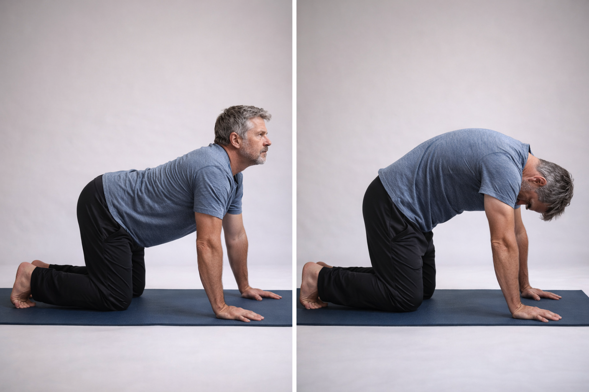

# Cat-Cow (Spinal Articulation)

**Purpose:** Gently mobilize each spinal segment, lubricate spinal joints, teach body awareness

**Duration:** 10-12 slow repetitions (5-6 complete cycles), 60-90 seconds total

---

## The Biomechanics

{ align=right width=40% }

Your spine has 24 [vertebrae](https://en.wikipedia.org/wiki/Vertebra) that should each move independently. Years of bracing, tension, and protective posturing create "stiff segments"—areas where vertebrae move together as a block instead of articulating individually.

This movement teaches your spine to articulate segment-by-segment again:

- Alternating flexion and extension lubricates [facet joints](https://en.wikipedia.org/wiki/Facet_joint)
- Engages deep spinal stabilizers ([multifidus](https://en.wikipedia.org/wiki/Multifidus_muscle), [erector spinae](https://en.wikipedia.org/wiki/Erector_spinae_muscles))
- Distributes [synovial fluid](https://en.wikipedia.org/wiki/Synovial_fluid) throughout spinal joints
- Restores the "wave-like" quality that healthy spines have

**The key insight:** Your spine should move like a wave, not a plank. If you can't feel individual vertebrae moving, you're going too fast or too aggressively.

---

## Why This Matters for Contractors

Forward-facing work creates spinal rigidity:

- Bracing while lifting locks the spine into protective patterns
- Hunching over workbenches flattens the natural spinal curves
- Vibration from power tools creates tension throughout the back
- Years of this creates a spine that moves as one stiff unit

Cat-Cow reverses this by asking each segment to move independently again.

---

## How to Do It

### Setup

1. Start on hands and knees on mat or carpet
2. Hands directly under shoulders, fingers pointing forward
3. Knees directly under hips, about hip-width apart
4. Spine starts in neutral—neither arched nor rounded
5. Look at floor about 12 inches in front of hands (neutral neck)

### Cow Phase (Inhale)

1. Drop belly toward floor (spinal extension)
2. Lift chest forward and up
3. Lift tailbone toward ceiling
4. Movement should feel like a wave starting at tailbone, moving through each vertebra to head
5. Gently look forward and slightly up (don't crank neck)

*Think: "Opening the front of the body"*

### Cat Phase (Exhale)

1. Tuck tailbone under
2. Round spine toward ceiling like a scared cat
3. Drop head to look toward thighs
4. Wave-like motion starting from tailbone, moving up through each vertebra

*Think: "Hollowing out the belly"*

### The Movement

- Take 5-10 seconds per transition
- Move like someone is drawing a finger down your spine, and each vertebra moves only when touched
- Complete 5-6 full cycles (10-12 total positions)

---

## Form Critical Points

- **Wave, not plank:** Each vertebra should move in sequence, not all at once
- **Tailbone leads:** Movement initiates from pelvis, ripples through spine, head follows last
- **Breathe with movement:** Inhale into cow, exhale into cat
- **Slow is better:** Speed destroys the segmental quality
- **Feel mid-back:** Most people only feel neck and lower back—actively try to feel mid-back moving

!!! tip "Jeff Cavaliere's Cue"
    "Imagine someone drawing a finger down your spine, and each vertebra moves only when touched. That's the speed and segmentation you want."

---

## What It Should Feel Like

**Normal sensations:**

- Gentle pulling through spine with each position
- Sense of individual vertebrae moving (develops over time)
- Slight warmth in spinal muscles
- Increasing freedom of movement as you progress through reps

**Should NOT feel:**

- Sharp pain in any vertebra
- Pinching in lower back during cow
- Neck strain or headache
- Dizziness

---

## Variations

### Forearm Version (Wrist Pain)

If wrists hurt bearing weight:

- Drop down to forearms instead of hands
- Same movement pattern
- Less wrist load, same spinal benefit

### Fist Version (Wrist Pain)

- Make fists instead of flat palms
- Bear weight on knuckles
- Maintains wrist neutral position

### Standing Version (Knee Pain)

If kneeling is uncomfortable:

- Stand facing wall, hands on wall at shoulder height
- Hinge at hips for cow (arch back)
- Round back for cat
- Smaller range but still beneficial

---

## Troubleshooting

??? question "Wrist pain when weight-bearing"
    - **Solution 1:** Make fists instead of flat palms, bear weight on knuckles
    - **Solution 2:** Do on forearms instead of hands (more stable, less wrist pressure)
    - **Solution 3:** Fold towel under heels of hands for cushioning

??? question "Knee pain from kneeling"
    - **Solution 1:** Double up mat, use thick folded blanket
    - **Solution 2:** Wear knee pads (construction knee pads work great)
    - **Solution 3:** Do standing version against wall

??? question "I don't feel anything"
    - **Cause:** Moving too fast, not isolating segments
    - **Solution:** Slow down to 5-10 seconds per transition
    - **Focus:** Can you feel your mid-back moving? Or just neck and lower back?
    - **Cue:** Imagine vertebrae as piano keys—press each one sequentially

??? question "Lower back feels crunchy or compressed in cow"
    - **Cause:** Forcing excessive arch, compressing lumbar spine
    - **Solution:** Think "lengthening" not "compressing"
    - **Check:** Are hands truly under shoulders? Move them slightly forward to reduce lumbar load
    - **Alternative:** Reduce range—don't go into full arch, just slight extension

??? question "Neck pain or tension"
    - **Cause:** Leading movement with head instead of tailbone
    - **Solution:** Keep head/neck neutral initially, add gentle movement only after mastering torso
    - **Cue:** "Tailbone leads, head follows"

---

## Bram's Experience

**Week 1:** Could barely feel mid-back moving. Focused on just the obvious areas (neck, lower back). Movement felt choppy and mechanical. "Like trying to move a rusty chain."

**Week 4:** Could feel individual [thoracic vertebrae](https://en.wikipedia.org/wiki/Thoracic_vertebrae) articulating. Movement becoming smoother. Felt like spine was "waking up" after years of dormancy.

**Month 3:** Movement became fluid, natural. Morning spinal stiffness reduced from 45 minutes to 5 minutes. Could feel each segment moving independently—the wave-like quality finally present.

**Long-term:** This became Bram's diagnostic tool. When his back felt "off," he'd do cat-cow and immediately know which segments were stuck. "It's like checking in with my spine every morning."

---

## Real-World Impact

"I didn't realize how much my spine had locked up until I started moving it again," Bram wrote in his journal. "Twenty years of bracing and protecting had turned my back into one solid block. Cat-cow taught me that each vertebra is supposed to move on its own. Once I understood that—once I could *feel* that—everything else started to improve."

Specific benefits:

- **Morning routine:** 90 seconds of cat-cow before getting out of bed eliminated the "old man shuffle" to the bathroom
- **Work preparation:** A few cycles before heavy lifting helped his spine be ready to move properly
- **End of day:** Evening cat-cow helped decompress the accumulated tension from the workday
- **Body awareness:** Developed ability to feel exactly where his back was tight or restricted

---

## Integration

Cat-Cow is the **first stretch in the Daily 8** because it prepares the spine for everything else:

- Warms up spinal joints before deeper stretches
- Activates spinal stabilizers
- Establishes body awareness for the session
- Takes minimal time but provides foundational benefit

**Recommended:** Do 5-6 cycles before progressing to the next stretch.

---

**Next:** [Child's Pose with Lat Stretch →](childs-pose.md)

---

*Return to [Daily 8 Overview](daily-8.md) | [All Exercises](index.md)*
