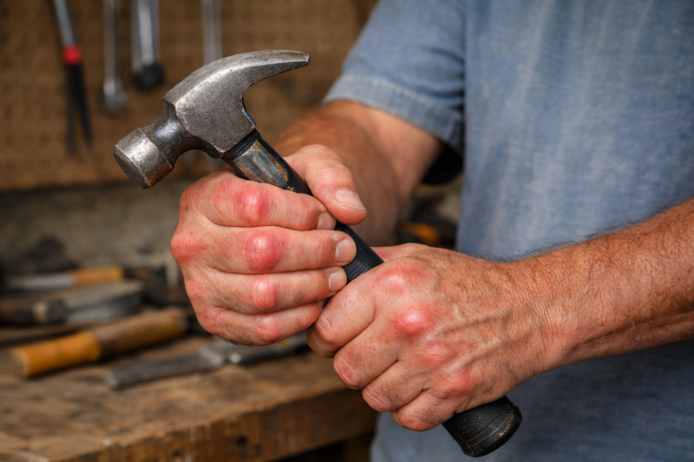
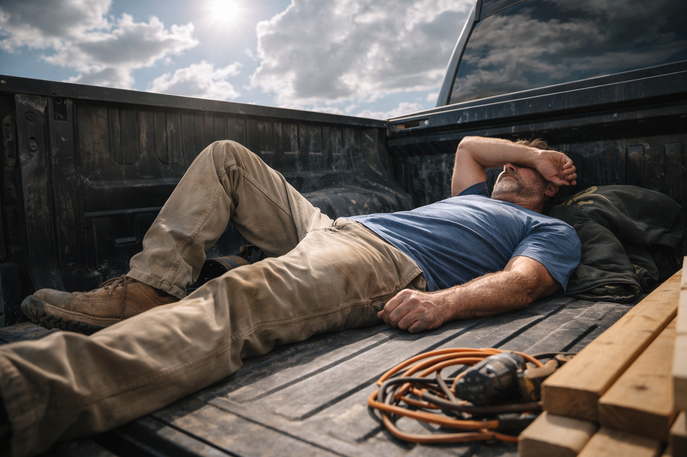

# When Did It Start?

> *"The body keeps the score."*
> — Bessel van der Kolk

---

Bram couldn't pinpoint the exact moment things changed. That's the insidious thing about slow decline—you don't realize you're drowning until water's already over your head.

Maybe it started that Tuesday in March when he needed both hands to pull himself out of his truck, gripping the door frame like a lifeline. Or the Saturday morning when tying his work boots took five minutes instead of thirty seconds, his fingers stiff and swollen like sausages that wouldn't bend the way they were supposed to. Or maybe it was months earlier, when the first whisper of morning stiffness began, so subtle he wrote it off as sleeping wrong.

At 45, Bram had always been *the guy*—the one who could outwork men half his age, who'd built his identity on physical competence the way some men build theirs on wealth or charm. Twenty years as a general contractor had built more than houses—it had built a sense of invincibility, a pride in never missing work, never complaining, always being the solution rather than the problem.

But over three months, that man disappeared.

---

## Month One: The Dismissal Phase

The morning stiffness came first, creeping in so gradually Bram almost didn't notice. Thirty minutes of walking like the Tin Man from *The Wizard of Oz*, waiting for his joints to "warm up" and remember how to move properly. His knees cracked when he stood from kneeling—sounds like Rice Krispies in a bowl of milk, loud enough that his crew started making jokes.

"Getting old, boss?" Miguel had said one morning, watching Bram grab the truck door frame to pull himself up after checking subflooring. The younger man's tone was teasing, affectionate even, but the words hit like a punch.

"Just worked hard yesterday," Bram said, forcing a laugh that felt like it belonged to someone else. "You'll understand when you're my age."

But inside, something whispered: *This isn't normal. Forty-five isn't old. My dad was doing this work at sixty-five.*

He ignored it. That's what you did when you were raised by a father who'd worked construction until 70, who'd never missed a day, never mentioned pain, never showed weakness. You pushed through. You didn't complain. Pain was just part of the job, proof you were working hard enough.

!!! warning "Bram's Mistake #1: Normalizing Early Symptoms"
    What seems like "just aging" or "working hard" can be your body's first alarm bell. The body doesn't lie—it communicates through symptoms. When we dismiss these early warnings as "normal," we miss the opportunity for early intervention, which is always easier than late-stage recovery.
    
    The cultural narrative of "toughing it out" and "no pain, no gain" can be actively harmful when it prevents us from recognizing genuine pathology.

By the end of month one, Bram was taking [ibuprofen](https://en.wikipedia.org/wiki/Ibuprofen) like candy. Two 200mg pills with breakfast, washed down with gas station coffee. Two more at lunch, grabbed from the bottle in his truck's glove compartment. Two with dinner, sometimes three. And on bad nights—which were becoming most nights—two more before bed, hoping to quiet the screaming in his lower back enough to sleep.

Eight pills a day. Sometimes ten. 1,600 to 2,000 milligrams of ibuprofen daily.

The pharmacy clerk at the CVS near his house knew his face by week three.

"You know these can damage your stomach lining, right?" she'd said once, scanning his third bottle that week. Her name tag said "Patricia" and her eyes held the kind of concern that made Bram uncomfortable.

"I'll be fine," he'd said, already looking away, credit card ready.

*I'll be fine.* The universal lie we tell ourselves when we're decidedly not fine but can't face that truth yet.

### The Adaptation Begins

The human body is brilliantly adaptive. When one system fails, others compensate. When movement hurts, the nervous system finds workarounds, new motor patterns that distribute load away from damaged areas.

This is both a blessing and a curse.

By late month one, Bram had developed a whole repertoire of compensations, so subtle even he didn't consciously recognize them:

- **The hip hitch:** When his right knee hurt, he'd hike his right hip up slightly when walking, effectively shortening that leg's stride and reducing knee flexion. This shifted load to his lower back.

- **The shoulder shrug:** When reaching overhead became painful, he'd shrug his shoulder up toward his ear to gain height without full shoulder flexion. This engaged his [upper trapezius](https://en.wikipedia.org/wiki/Trapezius_muscle) and [levator scapulae](https://en.wikipedia.org/wiki/Levator_scapulae_muscle) muscles, which weren't designed for that load.

- **The spinal rigidity:** When bending at the waist caused lower back pain, he kept his spine completely rigid and reached with his arms. This meant his hip joints bore excessive rotational stress.

- **The grip shift:** When his right hand was too swollen to grip properly, he'd over-grip with his left, creating muscular imbalances and left-side overuse.

Each compensation solved an immediate problem while creating future ones. His body was like a building slowly shifting on its foundation—each timber adjusting to prevent collapse, but the overall structure becoming increasingly unstable.

!!! danger "The Compensation Cascade"
    When you compensate for pain in one area, you're not eliminating the problem—you're redistributing it. The body works as an integrated system. A knee problem becomes a hip problem becomes a back problem becomes a neck problem.
    
    This is why addressing only the symptom (the current pain location) without addressing the root cause and the compensation patterns leads to chronic issues that seem to "move around" the body.
    
    *See [The Daily 8](../exercises/daily-8.md) for stretches that address these interconnected patterns.*

---

## Month Two: The Adaptation Phase

The second month was when the line between "injured but functional" and "significantly disabled" started to blur.

Mornings became a strategic operation. Bram would set his alarm 45 minutes earlier than necessary, giving himself time for the process of becoming vertical. Roll to his side. Pause. Slide legs off bed. Pause. Use arms to push to sitting. Pause. Stand, gripping the nightstand until his knees agreed to bear weight.

The first steps to the bathroom were the worst—a shuffling, hunched walk that looked like parody but felt like survival.

"Dad, this isn't normal," Emma said one morning, catching him mid-shuffle in the hallway. His daughter had stayed over after bringing groceries the night before, worried in that way adult children worry when they realize their parents are suddenly, terrifyingly mortal.

"It's just first thing in the morning," Bram said, straightening up with effort, trying to look normal. "Loosens up after I move around."

"For how long?"

"Half hour. Maybe forty-five minutes."

"Dad. That's not loosening up. That's being in pain for forty-five minutes and getting used to it."

She was right, of course. But Bram had perfected the art of reframing—morning stiffness wasn't a symptom, it was just a warm-up period. Needing ibuprofen wasn't dependence, it was practical pain management. Delegating more tasks to his crew wasn't disability, it was good leadership.

### The Crew Notices

Miguel and Marcus, his two primary crew members, had started adapting their work patterns around Bram's limitations without explicitly discussing it. This silent accommodation was both touching and humiliating.

"Boss, I'll grab that," Marcus would say, intercepting Bram before he could kneel to check floor joists.

"I got the ladder work," Miguel would volunteer before Bram could even reach for the ladder.

The tasks Bram used to handle reflexively—the physical problem-solving that had been his pride—were being quietly redistributed. He found himself directing more, demonstrating less. Pointing instead of showing. Supervising instead of doing.

The lunch breaks got longer. Bram would lie flat in his truck bed, a rolled-up jacket under his knees, staring at the sky through breaks in the clouds, trying to decompress his spine enough to make it through the afternoon. The cold metal against his back was simultaneously soothing and depressing.

Some days, standing back up took two attempts. The first try would send shooting pain through his lower back, forcing him down. The second try, carefully orchestrated with hand placement and breath control and sheer determination, would get him vertical.

*Just pushed too hard this week. Next week will be better.*

Next week wasn't better.

### The Night He Couldn't Get Up

Three weeks into month two, Bram had his first moment of genuine fear.

It was 11 PM on a Tuesday. He'd worked a full day despite the pain, determined to prove he was still capable, still the man he'd always been. He'd made it home, microwaved a frozen dinner, and collapsed onto the couch to eat, too tired to sit at the table.

An hour later, he woke to infomercials flickering on the TV and the realization that he needed to get to bed. He tried to stand.

His body said no.

Not the usual morning stiffness, not the knee pain he'd grown accustomed to. This was complete system failure. His hips wouldn't flex. His back wouldn't bend. His knees felt locked in place.

He tried again, pushing with his arms, attempting to lever himself up. Pain shot through his lower back so intense it pulled a gasp from his throat. He dropped back onto the couch, breathing hard, heart racing.

*What is happening to me?*

For ten minutes, he sat there, running through options. Call Emma? At 11 PM? And say what—that he'd fallen and couldn't get up like some late-night commercial? Call 911? And explain what emergency exactly—that he was 45 and couldn't stand up from his own couch?

Pride and fear battled in his chest. Pride won, barely.

He rolled—literally rolled—off the couch onto the floor. Army-crawled to the bathroom. Pulled himself up on the sink, using the counter and sheer upper body strength. His reflection in the mirror looked hollow-eyed and haggard.

*This is fine. This is temporary. Tomorrow will be better.*

But he knew, in that moment, that he was lying to himself.

### The Midnight Ice Session

Emma found him at midnight, sitting on the couch with ice packs on both knees, another on his lower back.

She'd come by to drop off leftovers from dinner—her way of checking on him without saying she was checking on him. She had a key. She'd used it. And there was her father, the man who'd taught her to ride a bike and build birdhouses and fix anything that broke, sitting in the dark with ice packs and a look of defeat she'd never seen before.

"Dad. What's going on?"

"Nothing. Old man stuff." His voice was rough, tired.

"You're 45. That's not old."

"Feels old."

She sat beside him, carefully, like he might break. Handed him a glass of water without being asked. For a long moment, they sat in silence, the TV still flickering its late-night commercials.

"You need to see a doctor."

"Doctors don't know anything."

"How would you know? You haven't been to one in ten years."

She was right. The last time Bram had been to a doctor was for his father's death—watching the emergency room staff scramble to save a man who'd been misdiagnosed for months, whose heart attack they'd called indigestion until the day it killed him. The system had failed when it mattered most, and Bram had internalized a deep distrust that day.

*I can figure this out myself. I've fixed everything else in my life. I can fix this.*

"Just give me another week," he said. "If it's not better, I'll go."

Emma looked at him with an expression he couldn't quite read—love mixed with frustration mixed with fear.

"Promise?"

"Promise."

He meant it, too. But the promise came with an unspoken caveat: *I'll go if I absolutely have to. If there's literally no other option. If I'm at the absolute end of what I can handle.*

He wasn't there yet. The drowning man still thought he could swim.

!!! note "The Isolation Pattern"
    When we're in pain—physical or emotional—we often withdraw. We minimize our condition to others. We convince ourselves we're handling it. We avoid seeking help until crisis forces our hand.
    
    This pattern is particularly common in people who've built their identity on self-reliance, who've learned that asking for help is weakness, who've been taught to "tough it out."
    
    But healing requires community. It requires vulnerability. It requires admitting we don't have all the answers.
    
    The sooner Bram could admit he needed help, the sooner he could actually get it. But he wasn't there yet.

---

## The Decline Continues

By the end of month two, Bram had lost 15 pounds—not intentionally, not from exercise, but from pain that made eating feel like too much effort. His clothes hung looser. His face looked gaunt in the mirror.

The crew had stopped joking about his stiffness. The silence was worse than the jokes.

Work had become a strategic game of energy management. Which tasks were absolutely necessary? Which could be delegated? How much could he push before his body completely gave out?

He started keeping a mental tally:

**Things I can still do:**

- Drive the truck (barely)
- Supervise from ground level
- Make phone calls and handle paperwork
- Light hand tools for short periods

**Things I can no longer do:**

- Climb ladders safely
- Kneel or squat for more than 30 seconds
- Lift anything over 25 pounds
- Work overhead
- Demonstrate proper technique physically
- Work a full 8-hour day without collapsing

The second list was growing faster than the first.

---

*Continue to [Chapter 2: The Cascade](chapter-2-the-cascade.md) or return to [Journey Home](index.md)*
