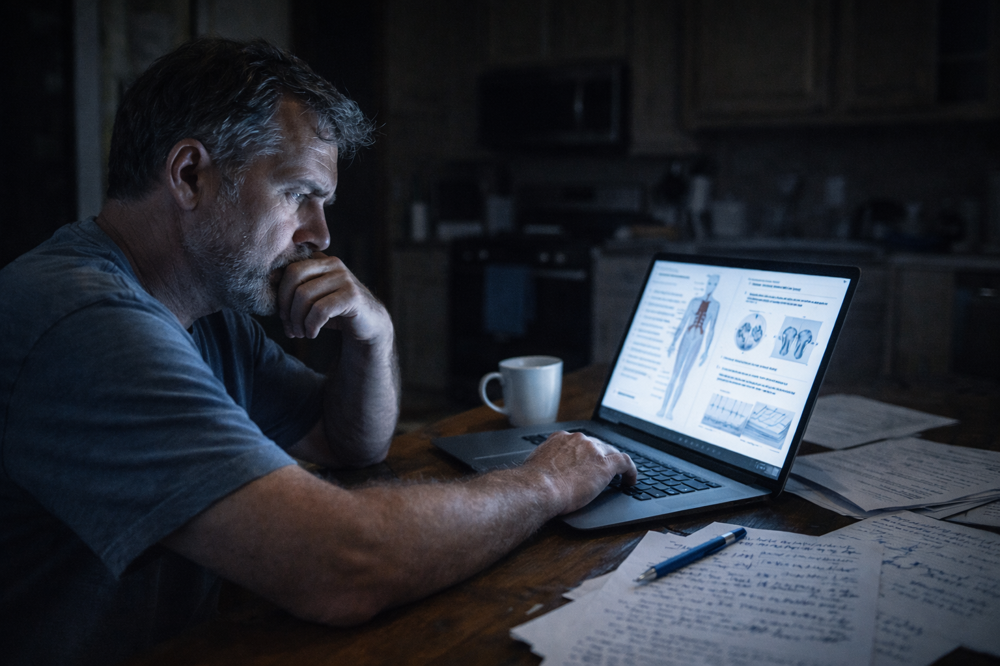

# The Cascade

> *"The body is a multilayered, interactive system, always in flux, always in motion. When one system is disrupted, the effects ripple outward."*
> — Gabor Maté

---

Month three began with false hope. Bram woke up one morning and, for the first time in weeks, didn't feel like he'd been hit by a truck. The stiffness was there, but manageable. The pain was present but not screaming.

*See? It's getting better. Just needed time.*

By noon, he knew he'd been wrong.

---

## The Ladder Incident

It was a Tuesday in late April, unseasonably warm, the kind of weather that made Bram remember why he loved this work. A client's living room crown molding job—simple work, meditative almost, the kind of task he'd done ten thousand times.

He was on the ladder, arms overhead, fitting a length of molding into place. Everything was fine until it wasn't.

His right knee gave out.

Not gradual weakness. Not a cramp. Complete, sudden, catastrophic failure of the joint to support weight.

One moment he was balanced, focused, competent. The next moment he was falling, grabbing desperately at the ladder with both hands, every muscle screaming, leg dangling uselessly, certain he was about to hit the floor from eight feet up.

Time did that thing it does in emergencies—stretched and compressed simultaneously. He hung there for what felt like minutes but was probably five seconds, his weight on his arms, his useless right leg swinging, heart pounding so hard he could hear it in his ears.

"Boss! BOSS!"

Marcus appeared below him, hands reaching up, steadying the ladder.

"I'm okay. I'm okay." Bram's voice sounded strange in his own ears—too high, too tight.

"You're not okay. Hold on."

The descent was agonizing. Each step down required shifting weight to the bad knee, which sent electric bolts of pain shooting up his leg. His hands, swollen and weak, could barely grip the ladder rungs. Marcus held the ladder steady, talking him down like you'd talk down someone from a ledge.

"Left foot. Good. Weight on the left. Now bring the right down. Don't put weight on it. Use your arms. That's it."

On solid ground, Bram couldn't straighten. His back locked in a forward hunch, his right knee refused to fully bear weight, and for the first time in his adult life, he felt genuinely, terrifyingly disabled.

"I'm calling Emma," Marcus said, phone already out.

"Don't—"

"I'm calling Emma."

The authority in the younger man's voice left no room for argument. Role reversal, complete.

---

## Urgent Care: The First Door Opens

Emma drove him to urgent care, Bram sitting rigid in the passenger seat, jaw clenched, refusing to look at her because he knew what he'd see—the same worried expression she'd had when she was eight and found a baby bird that had fallen from its nest, the same helpless concern when faced with something broken she couldn't fix.

The urgent care waiting room smelled like antiseptic and fear. Bram filled out forms with swollen fingers that barely worked, checking boxes about pain levels (7? 8? What's the right answer that gets help without seeming dramatic?), medical history (none), medications (just ibuprofen, lots of it).

The doctor was young, efficient, and dismissive in a way that made Bram's instinctive distrust of medical professionals feel validated.

Dr. something-or-other—Bram didn't catch the name—barely glanced up from his tablet as Bram described the last three months. The morning stiffness. The progression. The ladder incident.

"[Arthritis](https://en.wikipedia.org/wiki/Osteoarthritis)," the doctor said, still looking at his screen. "Common at your age with your profession."

"That's it? You're not going to examine me? Run tests?"

"What else were you expecting?"

"I don't know. Bloodwork? X-rays? I went from totally fine to barely functional in three months. That seems fast."

The doctor finally looked up, and in his eyes Bram saw something that made his blood boil: a kind of weary patience you'd use with someone being unreasonable.

"Three months is actually pretty slow for osteoarthritis progression in someone with your activity level and..." he glanced at Bram's chart, "weight."

The judgment landed like a slap. Bram was 6'1" and 215 pounds—down from his usual 230. Not obese. Just... solid. The build of someone who'd worked physically his entire life.

"So what do I do?"

"Lose weight. Take [Aleve](https://en.wikipedia.org/wiki/Naproxen) instead of ibuprofen—it's better for inflammation. Ice it. If it's not better in six weeks, see a rheumatologist."

The doctor was already standing, ready to move on to the next patient.

"That's it?"

"That's it. We'll send your records to rheumatology. They'll call you to schedule."

Bram stood carefully, using the exam table for support, feeling Emma's hand on his elbow even though he wanted to shake it off, wanted to prove he didn't need help.

"Six weeks?" he said.

"For the rheumatology appointment, probably longer. Wait list is usually 8-10 weeks. But try the weight loss and Aleve first. Most people feel better with basic lifestyle changes."

*Most people.*

In the car, Emma looked at him, key in the ignition but not turning it yet.

"What now?"

"I don't know."

"Are you going to wait six weeks?"

"What choice do I have?"

"You could get a second opinion. Try a different doctor."

"And hear the same thing? 'Lose weight, take Aleve, wait'?"

Silence filled the car. Finally, Emma started the engine.

"So what are you going to do?"

Bram stared out the window at the parking lot, watching people walk normally, move normally, live in bodies that worked the way bodies were supposed to work.

"Figure it out myself, I guess."

!!! danger "The Medical Dismissal"
    One of the most damaging experiences in healthcare is being dismissed when you know—in your bones, in your gut—that something is seriously wrong. This doesn't mean the doctor is wrong about the diagnosis. But it often means the doctor is wrong about the severity, the impact on quality of life, or the patient's urgency.
    
    Being told "it's just arthritis, lose weight" when you've gone from capable to disabled in three months is dismissal masquerading as diagnosis.
    
    This doesn't mean you're wrong. It means you need better advocates. Keep searching.

---

## The Research Rabbit Hole

That night, Bram fell down the internet rabbit hole.

Emma helped, initially—showing him how to navigate Google Scholar, how to find actual research instead of just random websites. But after an hour, she went home, leaving Bram alone with his laptop and a growing sense of both horror and recognition.

Forums full of people with eerily similar stories. Reddit threads that read like his own diary. Medical journal abstracts that he barely understood but tried to puzzle through anyway, looking up terms in separate tabs, building a vocabulary of his own dysfunction.

**Terms he learned:**

- [Chronic Inflammatory Response Syndrome (CIRS)](https://en.wikipedia.org/wiki/Chronic_inflammatory_response_syndrome)
- [Reactive arthritis](https://en.wikipedia.org/wiki/Reactive_arthritis)
- [Autoimmune arthritis](https://en.wikipedia.org/wiki/Rheumatoid_arthritis)
- [Seronegative arthritis](https://en.wikipedia.org/wiki/Seronegative_rheumatoid_arthritis)
- [Inflammatory cytokines](https://en.wikipedia.org/wiki/Cytokine)
- [Environmental illness](https://en.wikipedia.org/wiki/Environmental_disease)
- [Biotoxin](https://en.wikipedia.org/wiki/Biotoxin) exposure

One phrase kept appearing: **mold illness**.[^cirs-research]

He clicked a link to a patient advocacy site:

> *"Chronic Inflammatory Response Syndrome (CIRS) from mold exposure can present as joint pain, chronic fatigue, cognitive dysfunction ('brain fog'), and systemic inflammation. Many patients report sudden or rapid onset of symptoms after exposure events, though low-level chronic exposure can also cause gradual decline. The condition is often dismissed by conventional medicine as it doesn't fit standard diagnostic categories. Blood tests typically show elevated inflammatory markers ([CRP](https://en.wikipedia.org/wiki/C-reactive_protein), [ESR](https://en.wikipedia.org/wiki/Erythrocyte_sedimentation_rate)) without clear autoimmune antibodies..."*

Bram stopped reading and looked around his living room with new eyes.

The water stain on the ceiling he'd been meaning to fix for two years—just cosmetic, he'd told himself, not urgent. The musty smell he'd stopped noticing weeks ago because your nose adapts to whatever environment you're in. The bathroom renovation he'd abandoned 18 months ago, plastic sheeting still covering the torn-out shower because he'd been too busy with paying work to finish his own projects.

*No. That can't be it. That's too simple. Too stupid.*

But something deep in his gut whispered: *Keep looking.*

He searched "mold joint pain rapid onset."

Hundreds of results. Thousands. People describing experiences nearly identical to his own.

He searched "mold exposure construction workers."

More results. Studies about occupational exposure. Forum posts from contractors, plumbers, restoration workers—all describing similar patterns of decline.

He searched "water damage mold bathroom."

And there it was—article after article explaining how water intrusion in bathrooms, especially in wall cavities, creates ideal conditions for toxic mold growth. How the most dangerous mold isn't always visible. How plastic sheeting without proper ventilation can actually *trap* moisture and create perfect breeding grounds.

His bathroom renovation—the project he'd started and abandoned, the exposed wall cavity with plastic sheeting, the slow leak he'd "sort of" fixed—wasn't just unfinished. It was potentially a toxic mold factory.

And his bedroom was directly adjacent to that bathroom.

And he'd been sleeping eight hours a night in that bedroom for 18 months, breathing whatever was growing behind those walls.

*Oh god.*

Bram stood up too fast, his back protesting, and walked to the bathroom. Pulled aside the plastic sheeting. The musty smell hit him immediately—how had he not noticed this? Behind the plastic, the wall cavity looked darker than it should. When he touched the exposed studs, they felt slightly damp.

He grabbed his phone, turned on the flashlight, peered deeper into the cavity.

There—barely visible in the phone's light—dark patches on the backside of the drywall. Fuzzy. Spreading. Not just one spot but several, like a constellation of organic destruction.

*How long has this been here?*

His stomach dropped. The timeline clicked into place:

- **18 months ago:** Started bathroom renovation, tore out shower
- **17 months ago:** "Fixed" the leak (but probably not completely)
- **16 months ago:** Covered exposed wall with plastic sheeting "temporarily"
- **15 months ago:** Got busy with work, bathroom project moved to "someday" list
- **3 months ago:** Tore down old drywall in guest bedroom (exposure event?)
- **3 months ago:** Symptoms began

*I've been sleeping next to toxic mold for over a year. And three months ago, I kicked it up into the air by tearing down old drywall.*

The drowning man had just realized there's no bottom to this ocean.

!!! tip "If You Suspect Mold"
    If Bram's story resonates with your situation, see [Mold Remediation Checklist](../resources/mold-remediation.md) for guidance on assessment and professional remediation.

---

*Continue to [Chapter 3: Crisis Point](chapter-3-crisis-point.md) or return to [Journey Home](index.md)*

[^cirs-research]: Chronic Inflammatory Response Syndrome (CIRS) was first characterized by Dr. Ritchie Shoemaker, who identified the role of biotoxins from water-damaged buildings in triggering chronic inflammatory responses in genetically susceptible individuals. See Shoemaker RC, House DE. "Sick building syndrome (SBS) and exposure to water-damaged buildings." *Neurotoxicology and Teratology* 28 (2006): 573-588.
