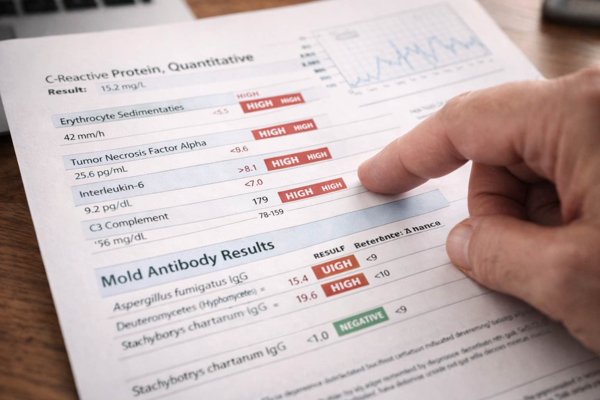
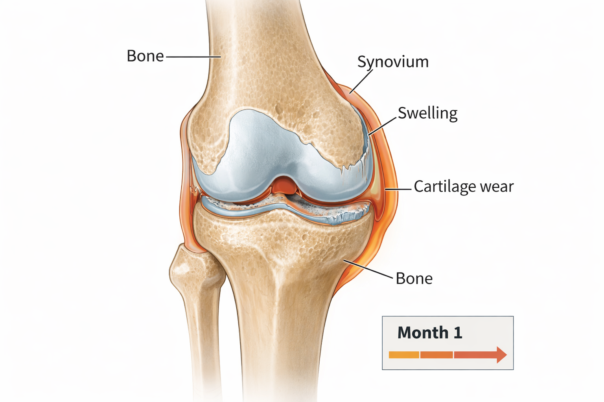

# The Testing

> *"The numbers don't lie. The body tells its story in blood and tissue, if only we know how to read it."*
> — Dr. Mark Hyman

---

Dr. Chen's testing protocol was more comprehensive than anything Bram had imagined. She handed him a stack of lab requisition forms that looked like a small novel.

"This is going to cost money," she said, not sugar-coating it. "Your insurance probably won't cover most of it. Functional medicine testing rarely does. We're looking at $800-1,200 for the full panel."

Bram thought about the $15,000 he'd been saving for a new truck. "Do it."

---

## The Blood Draw

The lab technician looked at his requisition forms with raised eyebrows. "Wow. We don't usually see orders this comprehensive."

She filled 12 vials of blood—dark red filling tube after tube, labels with codes Bram didn't understand: CRP, ESR, ANA, RF, Anti-CCP, HLA-DR, IgG panels, Vitamin D, Omega-3 Index, and more.

"You're going to feel a little lightheaded," she said. "We took a lot."

Bram felt more than lightheaded. He felt like he was literally pouring his body's secrets into glass tubes, sending them off to reveal truths he might not want to know.

### The Waiting Game

Results would come back in stages over two weeks. Dr. Chen warned him: "Try not to obsessively check your patient portal. I know you will anyway. But the numbers mean nothing without context, and I'll interpret them all together when we have the full picture."

Bram lasted three days before checking the portal every morning.

The first results appeared on day five:



| Test | Result | Normal Range |
|------|--------|--------------|
| C-Reactive Protein (CRP) | 15.2 mg/L | < 3.0 mg/L |
| Erythrocyte Sedimentation Rate | 42 mm/hr | < 15 mm/hr |

Bram didn't understand the numbers, but he understood the red flags next to them. He Googled CRP levels:

> *"CRP above 10 mg/L indicates severe inflammation. Levels this high are associated with active inflammatory disease, chronic infections, or severe tissue damage."*

His was 15.2. Five times normal.

*So the inflammation is real. It's not in my head. The numbers prove it.*

!!! info "Understanding Inflammatory Markers"
    **C-Reactive Protein (CRP):** A protein produced by the liver in response to inflammation. Elevated CRP indicates active inflammation somewhere in the body but doesn't specify location or cause.
    
    **Erythrocyte Sedimentation Rate (ESR):** Measures how quickly red blood cells settle in a test tube. Faster settling (higher number) indicates inflammation. It's a non-specific marker that confirms inflammation but doesn't diagnose the cause.
    
    These tests are like a smoke detector—they tell you there's fire, but not where or why. That's what the additional testing is for.

---

## The Full Panel Results

Two weeks after the initial blood draw, Dr. Chen called him in for a results consultation. She had everything printed out, organized in a folder with his name on it.

"Let's walk through this systematically," she said, spreading papers across her desk.

### Inflammatory Markers

| Test | Bram's Result | Normal Range |
|------|---------------|--------------|
| C-Reactive Protein | 15.2 mg/L | < 3.0 mg/L |
| ESR | 42 mm/hr | < 15 mm/hr |
| Fibrinogen | 485 mg/dL | 200-400 mg/dL |

*All significantly elevated*

"Your inflammatory markers are dramatically elevated," Dr. Chen explained. "This confirms massive systemic inflammation. Your body is in full defensive mode."

### Autoimmune Panel

| Test | Result | Interpretation |
|------|--------|----------------|
| Rheumatoid Factor (RF) | Negative | No RA antibodies |
| Anti-CCP Antibodies | Negative | No RA antibodies |
| ANA (Antinuclear Antibodies) | 1:40 (Weakly positive) | Borderline |
| Anti-dsDNA | Negative | No lupus antibodies |
| HLA-B27 | Negative | No AS indicator |

*Mostly negative*

"This is actually good news," Dr. Chen said. "The classic autoimmune markers are negative or barely positive. This suggests your inflammation is *reactive*—your body is responding to something external—rather than primary autoimmune disease where your body attacks itself for no clear reason."

"So it's not arthritis?"

"It's inflammatory arthritis, yes. But reactive, not rheumatoid. Meaning if we remove the trigger, your body should be able to calm down. With rheumatoid arthritis, the trigger is internal and permanent. This is external and potentially reversible."

Bram felt something loosen in his chest—not quite hope, but maybe possibility.

### Mold and Mycotoxin Panel

| Antibody | Result | Interpretation |
|----------|--------|----------------|
| IgG [*Aspergillus*](https://en.wikipedia.org/wiki/Aspergillus) | Elevated | Significant past/ongoing exposure |
| IgG [*Stachybotrys*](https://en.wikipedia.org/wiki/Stachybotrys) | Elevated | Significant past/ongoing exposure |
| IgG [*Penicillium*](https://en.wikipedia.org/wiki/Penicillium) | Elevated | Significant past/ongoing exposure |
| IgE Total | Normal | No acute allergic response |

"This is the smoking gun," Dr. Chen said, tapping the paper. "Your body has mounted significant immune responses to multiple mold species—*Aspergillus*, *Stachybotrys*, *Penicillium*. These are exactly the species commonly found in water-damaged buildings."

"Stachybotrys is black mold, right?"

"That's the common name, yes. It's one of the most toxic species.[^stachybotrys] The fact that you have elevated antibodies to it means you've been exposed, and your immune system has been fighting it."

### Genetic Susceptibility

| Test | Result and Meaning |
|------|-------------------|
| HLA-DR | Positive for 4-3-53 haplotype. Genetic inability to properly clear biotoxins; approximately 24% of population has susceptible variants[^hla-dr] |

"This explains why you got so sick when maybe others wouldn't," Dr. Chen said. "About a quarter of people have genetic variations in their [HLA-DR genes](https://en.wikipedia.org/wiki/HLA-DR) that make them unable to properly identify and clear biotoxins like [mycotoxins](https://en.wikipedia.org/wiki/Mycotoxin). Your body literally can't recognize these as foreign invaders efficiently enough to eliminate them."

"So the mold toxins just... stay in me?"

"They accumulate. They trigger continuous inflammatory responses. Your immune system keeps trying to fight something it can't effectively clear. It's like being stuck in a loop—constant exposure plus inability to clear equals chronic inflammation equals tissue damage."

### Nutritional Status

| Nutrient | Bram's Level | Optimal Range |
|----------|--------------|---------------|
| Vitamin D | 18 ng/mL | 40-60 ng/mL |
| Omega-3 Index | 3.2% | > 8% |
| Magnesium (RBC) | 4.2 mg/dL | 6.0-6.5 mg/dL |
| Zinc | 65 mcg/dL | 90-120 mcg/dL |
| B12 | 385 pg/mL | > 500 pg/mL |

*Multiple critical nutrients low*

"These deficiencies are both cause and effect," Dr. Chen explained. "Chronic inflammation depletes nutrients. But these specific deficiencies also *worsen* inflammation and impair healing. Vitamin D is crucial for immune regulation. Omega-3s are anti-inflammatory. Magnesium is required for hundreds of enzymatic processes. We need to correct all of these."

---

## The Diagnosis

Dr. Chen pulled out a fresh piece of paper and drew a simple diagram:



```
MOLD EXPOSURE (home environment)
            ↓
GENETIC SUSCEPTIBILITY (HLA-DR)
            ↓
INABILITY TO CLEAR TOXINS
            ↓
CHRONIC IMMUNE ACTIVATION
            ↓
SYSTEMIC INFLAMMATION
            ↓
TISSUE DAMAGE (joints, nervous system, gut)
            ↓
NUTRITIONAL DEPLETION
            ↓
IMPAIRED HEALING
            ↓
WORSENING SYMPTOMS
```

"This is what's happening to you," she said. "It's a cascade. Once it starts, it perpetuates itself. Your body is stuck in this loop."

"How do we break the loop?"

"We attack it from multiple angles simultaneously:

**One:** Remove the exposure—you cannot heal while still being poisoned. Your home needs professional remediation, and you need to move out during the process.

**Two:** Support detoxification—help your body clear the accumulated toxins it couldn't clear on its own.

**Three:** Reduce inflammation—through diet, supplements, and lifestyle modifications.

**Four:** Correct nutritional deficiencies—give your body the raw materials it needs to heal.

**Five:** Physical rehabilitation—carefully rebuild strength and function without triggering inflammatory flares.

**Six:** Patience—this didn't happen overnight, and it won't resolve overnight."

"How long?"

"If you're aggressive and compliant? You should start feeling notably better in 6-8 weeks. Significant improvement in 3-4 months. Full recovery of joint function?" She paused. "That's 6-12 months, depending on how much cartilage damage has occurred and how well you respond to treatment."

Bram felt the weight of that timeline. Six months to a year. But also: *there's a path. There's a plan. I'm not just drowning anymore—there's a shore I can swim toward.*

!!! success "The Power of Diagnosis"
    A proper diagnosis—even when it's complicated—provides something invaluable: **direction**.
    
    Bram had spent three months in a fog of confusion, dismissed by conventional medicine, unable to understand what was happening to him. Now he had:
    
    - Objective evidence (the bloodwork)
    - A clear mechanism (exposure + genetics + inflammation)
    - A logical path forward (multi-pronged intervention)
    - Realistic expectations (timeline and prognosis)
    
    This doesn't minimize the work ahead. But it transforms it from helpless suffering to purposeful action.

---

*Continue to [Chapter 5: The Home Inspection](chapter-5-the-home-inspection.md) or return to [Journey Home](index.md)*

[^stachybotrys]: *Stachybotrys chartarum* produces trichothecene mycotoxins, which are among the most potent naturally occurring toxins. These mycotoxins can cause immunosuppression, inflammation, and cellular damage. See Pestka JJ. "Mechanisms of deoxynivalenol-induced gene expression and apoptosis." *Food Additives and Contaminants* 25.11 (2008): 1128-1140; and WHO guidelines on mycotoxin health effects.

[^hla-dr]: The 24% figure comes from Dr. Ritchie Shoemaker's research identifying specific HLA-DR haplotypes (including 4-3-53, 11-3-52B, and others) that impair biotoxin clearance. Shoemaker RC, House DE. "A time-series study of sick building syndrome." *Neurotoxicology and Teratology* 28 (2006): 573-588. The exact prevalence varies by population and which haplotypes are included in the count.
