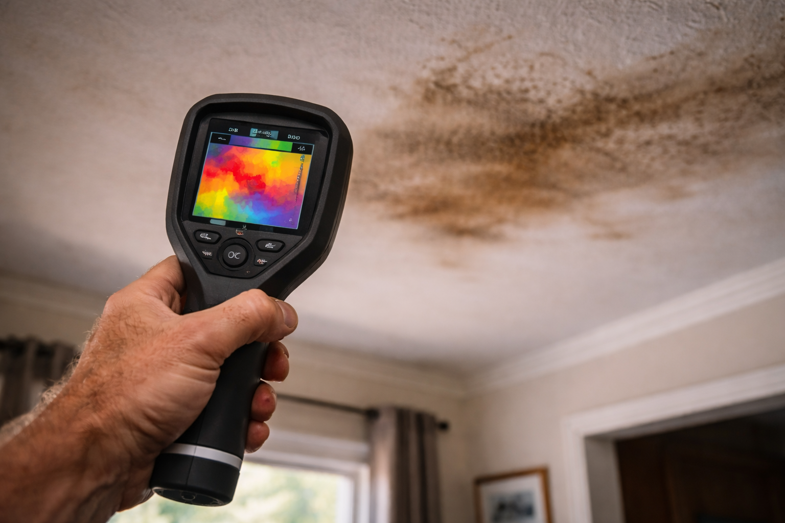

# The Home Inspection

> *"We shape our buildings; thereafter they shape us."*
> — Winston Churchill

---

Dr. Chen referred Bram to Paul Hendricks, a certified mold inspector who'd been doing environmental assessments for 20 years. Paul had seen everything—flooded basements, hurricane damage, hidden leaks that had been growing mold for decades.

"I can tell before I even test," Paul said, walking through Bram's front door and immediately wrinkling his nose. "You've got a problem."

Bram, who'd long ago stopped noticing the smell, felt a flush of embarrassment. "It's that obvious?"

"To someone who hasn't acclimated to it, yes. Your nose stops registering smells you're exposed to constantly. That's a survival mechanism, but it means you can be living in pretty bad conditions without realizing it."

---

## The Walkthrough

Paul moved through the house methodically, carrying a moisture meter, [thermal imaging camera](https://en.wikipedia.org/wiki/Thermographic_camera), and [ERMI](https://en.wikipedia.org/wiki/Environmental_Relative_Moldiness_Index) test kit. He took notes on a tablet, photographing everything.

### The Ceiling Stain

"Let's start here," Paul said, pointing at the water stain Bram had been ignoring for two years.

He held the moisture meter against the ceiling. It beeped aggressively.

"This isn't just a stain. The ceiling material is still wet. That means either there's an active leak, or the insulation above is saturated and holding moisture. Either way, this is a mold farm."

He pulled out the thermal camera, which showed the ceiling in colored heat signatures. A large blue patch—indicating cold, wet material—spread across an area three times larger than the visible stain.

"See this? The visible stain is maybe two feet across. The actual water damage is six feet. And I'd bet good money there's black mold growing in that attic space, probably in your HVAC ducts too, circulating spores through your whole house every time the heating or cooling kicks on."

Bram felt sick. "I had no idea."

"Most people don't. Water damage is sneaky. What you see is always smaller than what's actually there."

### The Bathroom

When they got to the bathroom, Paul actually whistled.

"How long has this been like this?"

"Year and a half," Bram admitted, shame creeping into his voice.

"Okay. So. Plastic sheeting over exposed wall cavity. No ventilation. Moisture from the shower next door. This is literally a perfect mold incubation chamber. You've created ideal conditions."

The moisture meter went wild when Paul pressed it against the wall near the old shower location.

"You've got water intrusion here. The wall cavity is wet. Has been for a long time, based on how the wood feels."

Paul took out a flashlight and peered into the exposed cavity. "Yeah. I can see mold growth from here. Dark patches on the backside of the drywall, fuzzy growth on the studs. This needs complete remediation—we're talking removing all affected materials, treating the framing, probably replacing subfloor if it's gotten down there."

### The Basement Workshop

They descended to the basement, where Bram spent hours most weeks at his workbench, building cabinets and doing detail work.

"Crawlspace access?"

"Over there."

Paul opened the crawlspace hatch. The smell that emerged was overwhelming—dank, musty, organic decay.

"You've got standing water under your house."

"What?"

Paul pointed his flashlight into the crawlspace. Bram could see it reflecting off water, pooled in the low spots.

"Probably groundwater coming up, or possibly a plumbing leak. Either way, you've got standing water, which means you've got high humidity, which means you've got mold. I can see it on the floor joists from here."

He pulled out his phone and took several photos for documentation.

"This is bad. This is pervasive. And because heat rises, all those mold spores are coming up through your floor into your living space. You're basically breathing basement air 24/7."

!!! warning "The Hidden Dangers of Crawlspaces"
    Crawlspaces are one of the most common sources of indoor air quality problems. Most homeowners never enter them, so problems go unnoticed for years.
    
    **Common issues:**
    
    - Standing water from poor drainage
    - High humidity (often 80-90%)
    - Mold growth on wood joists and subfloor
    - Air from crawlspace entering home through gaps and penetrations
    - HVAC ducts in crawlspace picking up contaminants
    
    **[The stack effect](https://en.wikipedia.org/wiki/Stack_effect):** Air pressure differences cause air to flow upward through a building. Whatever's in your crawlspace air is coming into your living space. This is why crawlspace mold often causes health issues for occupants, even if they never go down there.

---

## The ERMI Test

Paul placed dust collection traps in five locations throughout the house—living room, bedroom, bathroom, basement workshop, and attic access.

"ERMI stands for Environmental Relative Moldiness Index," he explained. "We collect settled dust, send it to a lab, they use DNA analysis to identify and quantify 36 different mold species. Then we get a score."

"What's a bad score?"

"Anything above 2 indicates elevated mold. Above 5 is high. Above 10 is extreme. Based on what I've seen today, I'd expect you to score somewhere between 8 and 15."

The samples went to the lab. Results would take 7-10 days.

### The Waiting

Those 7 days were difficult. Bram continued living in the house—he had nowhere else to go yet—but now he couldn't stop noticing things he'd been blind to.

The musty smell when he opened closets. The way his nose ran more in the house than outside. The slight headache that started about an hour after coming home from work. The way his symptoms seemed worse on rainy days.

*How did I not see this? How did I live like this for so long?*

Emma came over to help him start packing essentials, preparing for the remediation he couldn't yet afford but knew was coming.

"Dad, this isn't your fault," she said, seeing the shame on his face.

"I'm a contractor. This is literally my job—identifying and fixing these problems. And I couldn't see it in my own house."

"That's the cobbler's children having no shoes. You've been too busy fixing everyone else's houses to take care of your own."

"That's not an excuse."

"It's not an excuse. It's an explanation. And it's human. Now we fix it."

---

## The Results

The ERMI report arrived via email at 6:47 PM on a Wednesday. Bram was sitting at his kitchen table, eating microwaved leftovers, when his phone chimed.

He opened the PDF with shaking hands.

**Overall ERMI Score: 12.7**

*Interpretation: Score above 10 indicates extreme mold contamination. Remediation strongly recommended.*

**Species Detected (Elevated Levels):**

- [*Stachybotrys chartarum*](https://en.wikipedia.org/wiki/Stachybotrys_chartarum) (Black mold, highly toxic)
- [*Aspergillus penicillioides*](https://en.wikipedia.org/wiki/Aspergillus)
- [*Aspergillus versicolor*](https://en.wikipedia.org/wiki/Aspergillus_versicolor)
- [*Chaetomium globosum*](https://en.wikipedia.org/wiki/Chaetomium) (Water damage indicator)
- [*Wallemia sebi*](https://en.wikipedia.org/wiki/Wallemia)
- [*Penicillium*](https://en.wikipedia.org/wiki/Penicillium) species (multiple varieties)

The report included a detailed breakdown by room:

| Location | Mold Score |
|----------|------------|
| Bedroom (master) | 14.2 |
| Bathroom (damaged) | 18.5 |
| Living Room | 9.3 |
| Basement Workshop | 15.7 |
| Attic Space | 16.1 |

Every single room was above the "safe" threshold. The bathroom and attic were catastrophically contaminated. And the bedroom—where he'd been sleeping for 18 months—was nearly as bad.

Paul called 20 minutes later.

"You got the report?"

"Yeah." Bram's voice sounded hollow even to himself.

"I'm sorry. I know this is hard to see. But in a way, it's good news."

"How is this possibly good news?"

"Because now you know. You have objective evidence. You have a clear problem with a clear solution. This isn't mysterious anymore—you were being poisoned, and now you know by what."

"The solution costs thousands of dollars I don't have."

"The solution costs money, yes. But staying there will cost you your health. Maybe your life. You need professional remediation, Bram. This isn't DIY territory. And you cannot stay in this house while it's being done."

"How much?"

"For contamination this extensive? Full bathroom tear-out, sections of the master bedroom, crawlspace encapsulation, HVAC system cleaning, probably some framing treatment, disposal of contaminated materials, post-remediation verification... you're looking at $15,000 to $25,000."

!!! tip "Professional Remediation"
    For guidance on finding qualified remediators and understanding the process, see [Mold Remediation Checklist](../resources/mold-remediation.md).

The number hit like a physical blow. That was the money he'd been saving for five years. That was supposed to be a new truck, maybe a small vacation with Emma, security.

"And I need to move out?"

"You need to move out today if possible. Continued exposure while you're trying to heal is like trying to recover from pneumonia while smoking a pack a day. The remediation will take 2-3 weeks minimum, possibly longer depending on what we find once we open up the walls."

---

*Continue to [Chapter 6: The Revelation and Decision](chapter-6-the-revelation-and-decision.md) or return to [Journey Home](index.md)*
